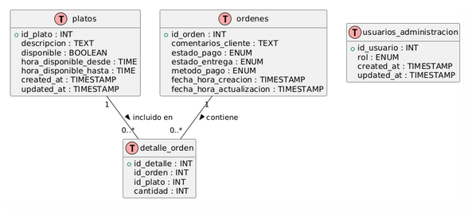
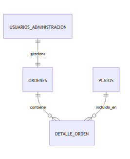
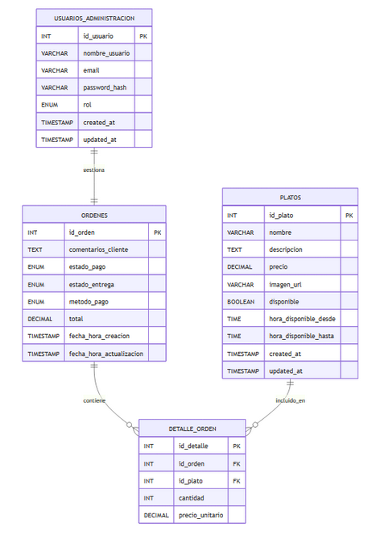

<!-- portada -->

# Sistema Web para Realizar y Administrar Pedidos de Platos en el restaurante Ají Causa
### Grupo **2**  
### INGENIERIA WEB **B1**  
**Resumen Ejecutivo, Introducción y Objetivos**  
_Proyecto de Desarrollo Web_

---

<!-- portada -->
 
# Integrantes
- Arce Gonzalez, Jose (https://orcid.org/0000-0002-0567-0973 )
- Alfaro Salina, Cindy Silvina (https://orcid.org/0000-0002-7922-6306)
- Cardenas Polo, Nicol Maricielo (orcid.org/0000-0002-9581-2284)
- Flores Andrade, Willy Patricio (https://orcid.org/0000-0002-5437-8784)
- Sánchez Trujillo, Valentino del Piero(https://orcid.org/0000-0002-4240-8456)
- Ventura Huayta, Jesus Antonio (https://orcid.org/0009-0000-2940-1746)


---

## 🧾 Resumen Ejecutivo

El restaurante **Ají Causa** presentaba problemas de desorganización y demoras debido al uso de métodos manuales para registrar pedidos y comunicarlos a cocina.

---

## 💡 Solución propuesta

Se desarrolló un **sistema web interno** que digitaliza el flujo de trabajo entre meseros y cocineros, utilizando:

- **PHP, JavaScript, TailwindCSS**
- Arquitectura **MVC**
- Contenedores **Docker**
- Peticiones **AJAX** asincrónicas

---

## ⚙️ Funcionalidades clave

- Registro de pedidos por meseros desde una interfaz responsiva.
- Visualización y actualización de órdenes por parte del chef.
- Panel de administración de platos (precio, horario, disponibilidad).
- Interfaz reactiva sin necesidad de recarga de página.

---

## ✅ Resultados

El sistema mejora:

- La eficiencia operativa.
- La reducción de errores humanos.
- La comunicación interna del restaurante.
- La calidad del servicio al cliente.

---

## 📖 Introducción

La transformación digital en el sector gastronómico es ahora una **necesidad estratégica**.

Mejora aspectos como:

- Rapidez del servicio.
- Precisión en los pedidos.
- Optimización de recursos humanos.

---

## 🍽️ Caso: Ají Causa

El sistema no es solo una carta digital, sino una solución integral para conectar:

- 👨‍🍳 Cocineros  
- 🧑‍💼 Administradores  
- 🧑‍🍳 Meseros

...en tiempo real y desde dispositivos móviles.

---

## 🖥️ Interfaz y flujo

1. Meseros registran pedidos desde dispositivos móviles.
2. El pedido aparece automáticamente en la pantalla de cocina.
3. El chef actualiza el estado (preparación, listo, entregado).
4. La administración gestiona platos y disponibilidad en tiempo real.

---

## 🧱 Fundamentos técnicos

El sistema se apoya en:

- **Base de datos estructurada** para trazabilidad.
- Gestión de roles y accesos.
- Automatización del flujo operativo.

---

## 🎯 Objetivo General

Desarrollar un sistema web interno que gestione:

- Pedidos
- Preparación en cocina
- Administración del menú

...optimizando el flujo de trabajo y mejorando la atención al cliente.

---

## 🎯 Objetivos Específicos (1/2)

- Diseñar una interfaz responsiva para la toma de pedidos.
- Implementar vista de cocina en tiempo real para gestión de órdenes.

---

## 🎯 Objetivos Específicos (2/2)

- Desarrollar un módulo de administración de platos.
- Registrar y visualizar el estado de los pedidos.
- Integrar control de acceso por roles (admin/editor).

---

## 🧰 Tecnologías y Herramientas

| Tecnología / Herramienta | Uso Principal |
|--------------------------|-------------------------------|
| PHP                      | Lógica del lado servidor       |
| JavaScript               | Lógica del lado cliente        |
| Tailwind CSS             | Estilos e interfaz             |
| Docker                   | Contenedores y despliegue local|
| HTML5 / CSS3             | Estructura y estilo            |
| MySQL                    | Base de datos                  |
| MVC                      | Patrón de arquitectura         |

 
---

## 🔄 Flujo de Información del Sistema

El sistema sigue una arquitectura **cliente-servidor con base de datos**, donde cada componente cumple un rol específico en el procesamiento de solicitudes.

---

## 🌐 Flujo de Información

1. **Cliente (Navegador Web)**  
   El usuario interactúa con formularios o botones (ej. actualizar precio de un plato).

2. **Servidor (PHP)**  
   Recibe la solicitud vía `POST` o `GET` y la envía al modelo.

3. **Modelo (DAO + SQL)**  
   Ejecuta operaciones sobre la base de datos.

4. **Base de Datos (MySQL)**  
   Procesa la consulta y retorna el resultado al modelo y vista.

5. **Respuesta al Cliente**  
   Se actualiza la interfaz con los nuevos datos o mensajes.

---

##  Ejemplo: Ciclo de Vida de una Solicitud HTTP

### Caso: Actualizar horario y precio de un plato

---

## ① Solicitud del Usuario

El **administrador** edita el precio y horario del plato en `admin_platos.php` y presiona “Actualizar”.

---

## ② Envío de la Solicitud

Se genera un **POST** hacia `actualizar_plato.php`:
```php
POST /views/actualizar_plato.php
Content-Type: application/x-www-form-urlencoded

id_plato=4&precio=20.00&hora_desde=12:00&hora_hasta=18:00
```


---

## ③ Procesamiento en el Controlador

El archivo `actualizar_plato.php`:

- Recibe y **valida** los datos.
- Llama a `PlatoDAO.php` para ejecutar la consulta.

---

## ④ Interacción con la Base de Datos

Ejecuta la consulta SQL:

```sql
UPDATE platos
SET precio = 20.00,
    hora_disponible_desde = '12:00',
    hora_disponible_hasta = '18:00'
WHERE id_plato = 4;
```
 

---

## ⑤ Respuesta y Redirección

El controlador redirige a `admin_platos.php`, que muestra la **tabla actualizada** con los nuevos valores.

---

## 🏗️ Ventajas del Uso de MVC

* ✅ **Claridad:** separación entre interfaz, lógica y datos.
* 🔧 **Mantenimiento:** cambios localizados, sin impacto global.
* 📈 **Escalabilidad:** fácil integración con nuevas funcionalidades.
* ♻️ **Reutilización:** modelos/controladores reutilizables.

---

##   Modelo de Clases (UML)
 
 


---

## 🗄️ Modelo de Base de Datos

### Diagrama Entidad-Relación (ER)




---

## 📊 Modelo Relacional

Tablas derivadas del ER, con llaves primarias y foráneas definidas.



---

# GRACIAS

